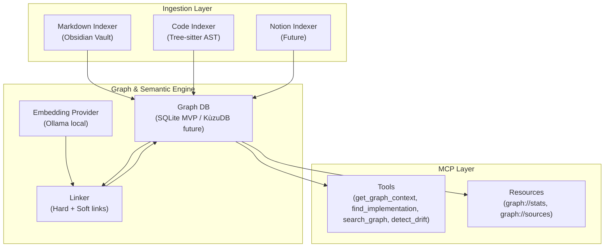

# 🤖 LKGB — Local Knowledge Graph Builder MCP

> A local-first MCP server that builds a semantic graph between documentation and code, so AI assistants can reason over real Note ↔ Code relationships instead of raw files.

[](https://www.typescriptlang.org/)
[](https://modelcontextprotocol.io/)
[](https://www.sqlite.org/)
[](https://ollama.com/)

## 📋 Table of Contents

- [Overview](#overview)
- [Why LKGB](#why-lkgb)
- [Key Features](#key-features)
- [Architecture](#architecture)
- [Data Model](#data-model)
- [MCP Interface](#mcp-interface)
- [Project Structure](#project-structure)
- [Implementation Phases](#implementation-phases)
- [Getting Started](#getting-started)
- [Configuration](#configuration)
- [Development Workflow](#development-workflow)
- [Roadmap](#roadmap)
- [Contributing](#contributing)

## 🎯 Overview

**LKGB (Local Knowledge Graph Builder)** solves a common gap in modern development workflows:

1. Notes and documentation (Obsidian, Markdown) live in one world.
2. Source code (functions, classes, modules) lives in another.

AI tools can read files, but usually don’t understand how ideas map to implementation.

LKGB scans local notes and code, extracts structure, computes semantic similarity, and builds a graph of relationships that MCP-compatible clients (Claude, Cursor, etc.) can query.

## 💡 Why LKGB

- **Local-first privacy**: processing stays on your machine.
- **Semantic linking**: hard links + embedding-based soft links.
- **Better LLM context**: returns subgraphs, not just raw text dumps.
- **Drift detection**: find orphan code and unimplemented notes.
- **Extensible ingestion**: architecture supports future sources (Notion, Confluence, Google Docs, etc.).

## ✨ Key Features

### 📥 Multi-Source Ingestion

- Obsidian/Markdown scanning with WikiLinks, tags, frontmatter extraction.
- Code indexing via Tree-sitter (functions, classes, modules, docstrings, TODOs).
- Adapter-based source interface for future data sources.

### 🧠 Semantic Graph Engine

- Unified graph with `Note`, `CodeEntity`, and `Tag` nodes.
- Hard edges from explicit links and naming matches.
- Soft edges from cosine similarity over local embeddings.
- Full-text and graph traversal queries.

### 🛠️ MCP Tools for AI Assistants

- `get_graph_context` — retrieve neighborhood context around an entity.
- `find_implementation` — map concept note to related code.
- `search_graph` — keyword/semantic/hybrid retrieval.
- `detect_drift` — identify alignment gaps between docs and implementation.

## 🏗️ Architecture



## 🗄️ Data Model

### Node Types

- `Note` — markdown/notion chunks and metadata.
- `CodeEntity` — functions, classes, modules with language/type metadata.
- `Tag` — parsed tags from notes (e.g. `#to-implement`).

### Edge Types

- `MENTIONS` (`Note → CodeEntity`) — WikiLinks / keyword matching.
- `IMPLEMENTS` (`CodeEntity → Note`) — semantic similarity above threshold.
- `HAS_TAG` (`Note → Tag`) — markdown tag extraction.
- `IMPORTS` (`CodeEntity → CodeEntity`) — code dependency analysis.
- `SIMILAR_TO` (`Note → Note`) — semantic note-to-note similarity.
- `DERIVED_FROM` (`Note → Note`) — cross-source alignment (e.g., Obsidian ↔ Notion).

## 🔌 MCP Interface

### Tools

- **`get_graph_context`**: return 1–N hop subgraph for an entity.
- **`find_implementation`**: locate code that implements a note/concept.
- **`detect_drift`**: report orphaned code and unimplemented ideas.
- **`search_graph`**: semantic, keyword, or hybrid graph search.

### Resources

- **`graph://stats`**: graph node/edge/source counts.
- **`graph://sources`**: configured source adapters and status.

### Transport

- **Primary**: `stdio` (Claude Desktop / Cursor).
- **Secondary**: HTTP/SSE (future/debug use).

## 📁 Project Structure

```text
local-knowledge-graph-builder-mcp/
├── src/
│   ├── index.ts
│   ├── server.ts
│   ├── config.ts
│   ├── ingestion/
│   │   ├── types.ts
│   │   ├── markdown-indexer.ts
│   │   ├── code-indexer.ts
│   │   ├── notion-indexer.ts
│   │   └── watcher.ts
│   ├── graph/
│   │   ├── schema.ts
│   │   ├── database.ts
│   │   ├── linker.ts
│   │   └── embeddings.ts
│   ├── tools/
│   │   ├── get-graph-context.ts
│   │   ├── find-implementation.ts
│   │   ├── detect-drift.ts
│   │   └── search-graph.ts
│   └── utils/
│       ├── logger.ts
│       ├── chunker.ts
│       └── similarity.ts
├── tests/
├── docs/
│   ├── product-vision.md
│   ├── system-architecture.md
│   ├── development-workflow.md
│   ├── implementation-plan.md
│   └── roadmap.md
├── package.json
├── tsconfig.json
└── README.md
```

> Note: this structure reflects the target architecture and implementation plan. Detailed planning docs are in `docs/`.

## 🧭 Implementation Phases

The project plan is split into 4 phases (91 tasks total):

- **Phase 1 (MVP)**: project setup, ingestion, SQLite graph, hard links, MCP basic tools.
- **Phase 2 (Semantics)**: embeddings, soft linker, semantic search.
- **Phase 3 (Automation)**: watcher, incremental updates, drift detection.
- **Phase 4 (Polish)**: docs, CI, release readiness.

Detailed phase breakdown: [docs/implementation-plan.md](docs/implementation-plan.md).

## 🚀 Getting Started

> This repository contains the project vision and implementation blueprint for LKGB.

### Prerequisites

- **Node.js** 20+
- **npm** (or pnpm/yarn)
- **Ollama** (for local embeddings, optional at first)
- Local Markdown vault and code directories to index

### Planned bootstrap steps

```bash
git clone <your-repo-url>
cd local-knowledge-graph-builer-mcp

# after scaffolding package.json and tsconfig
npm install
npm run dev
```

## ⚙️ Configuration

Planned config source: `lkgb.config.json` or environment variables.

### Example `lkgb.config.json`

```json
{
    "databasePath": "./data/lkgb.sqlite",
    "similarityThreshold": 0.75,
    "sources": [
        {
            "id": "obsidian",
            "vaultPath": "C:/Users/you/ObsidianVault"
        },
        {
            "id": "code",
            "paths": ["C:/projects/my-app/src"]
        }
    ],
    "embeddings": {
        "provider": "ollama",
        "model": "nomic-embed-text",
        "baseUrl": "http://localhost:11434"
    }
}
```

## 🔄 Development Workflow

Branching and commit strategy:

- `main` — stable release branch.
- `dev` — integration branch.
- `feature/<name>` — feature group branch from `dev`.
- One task = one commit.

Workflow details: [docs/development-workflow.md](docs/development-workflow.md).

### Commit convention

```text
<type>(<scope>): <short description>

- detail 1
- detail 2

Task: #<task-id>
```

Types: `feat`, `fix`, `refactor`, `test`, `docs`, `chore`, `style`.

## 🛣️ Roadmap

After MVP and core phases, planned improvements include:

- New sources: Notion, Google Docs/Drive, Confluence, Jira/Linear.
- Advanced MCP tools: `suggest_links`, `explain_dependency`, `generate_summary`, `time_travel`.
- Technical upgrades: incremental embeddings, vector store, multi-vault support.
- UX layer: graph visualization, Obsidian plugin, VS Code extension.

Full roadmap ideas: [docs/roadmap.md](docs/roadmap.md).

## 🤝 Contributing

1. Create a branch from `dev` for a task group.
2. Implement tasks with one commit per task.
3. Open PR to `dev` with task checklist.
4. Merge `dev` to `main` for releases.

Please follow architecture and workflow docs before adding new modules.

---

**Built for local-first, semantically aware AI development workflows.**
